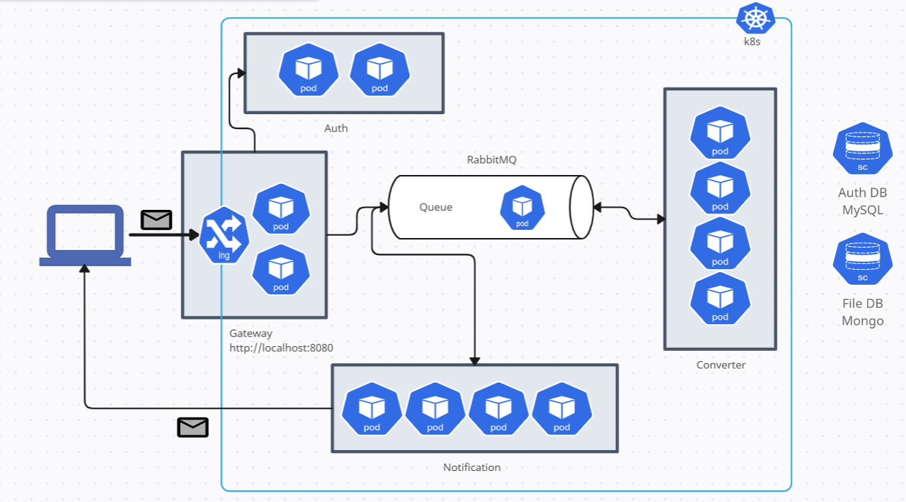

# Word-to-PDF Converter Microservices Architecture

This project implements a Word-to-PDF converter using a microservices architecture deployed in Kubernetes (K8s). The architecture consists of the following services:

## Services

1. Authentication Service: This service handles user authentication and authorization. It ensures that only authenticated users can access the converter service and other protected resources. It runs with 2 replicas for high availability.

2. Gateway Service with Ingress: The gateway service acts as an entry point to the system and provides an API for clients to interact with. It handles requests from clients and routes them to the appropriate services. The Ingress controller handles routing external requests to the gateway service. The gateway service runs with 2 replicas.

3. Converter Service: This service is responsible for converting uploaded Word documents to PDF format. It scales horizontally with 4 replicas to handle concurrent conversion requests efficiently.

4. RabbitMQ Messaging Pod: This pod hosts the RabbitMQ messaging system, which is used for queuing the uploaded files. It ensures reliable delivery of files to the converter service and enables asynchronous processing. It runs with 1 replica.

5. Notification Service: This service is responsible for sending notifications to users containing the file ID of the converted PDF file. It scales horizontally with 4 replicas to handle the notification workload efficiently.

## Architecture

The above diagram represents the deployment of the microservices architecture in Kubernetes. It shows the different services, their replicas, and their interactions.

## Deployment and Configuration

To deploy this microservices architecture in Kubernetes, follow these steps:

1. Set up a Kubernetes cluster if you don't have one already.

2. Deploy the authentication service, gateway service, converter service, RabbitMQ messaging pod, and notification service using the provided Kubernetes deployment files or manifests.

3. Configure the necessary environment variables and service dependencies for each service.

## License

This project is licensed under the [MIT License](LICENSE).
